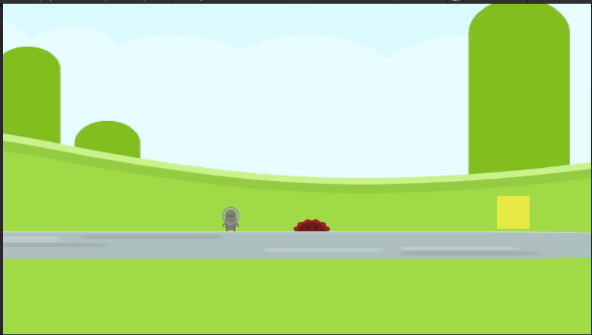
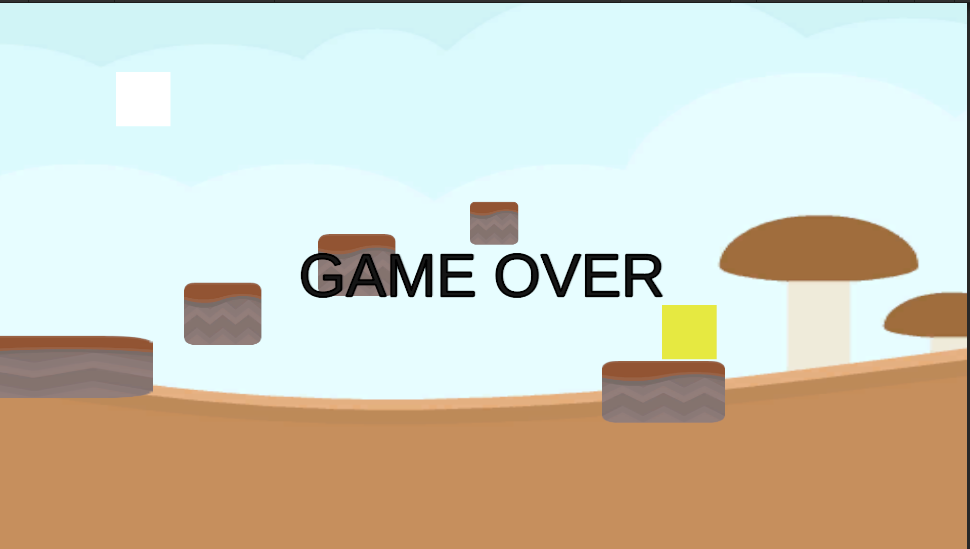
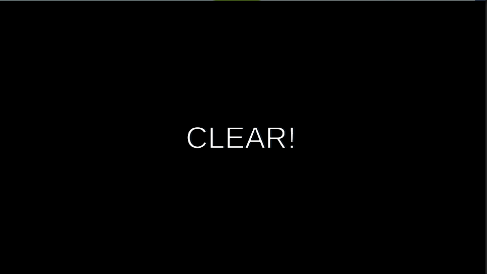
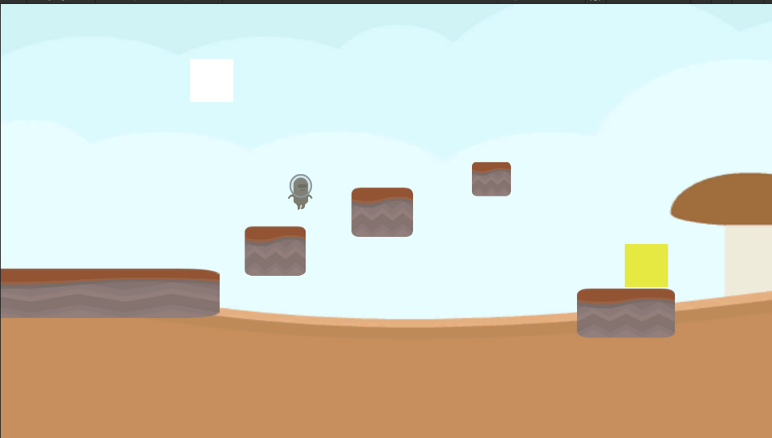

# Unity-2D-Platformer
2D platformer game made with Unity
# 2D Platformer Game (Unity)

## Overview
This is a 2D platformer game developed using Unity.

The player moves through stages while avoiding traps and aiming for the goal.
## Gameplay

### Stage 1
Player starts and moves toward the goal while avoiding obstacles.

### Game Over
Player hits a spike or falls → Game Over screen is displayed.

### Clear
Goal reached → Stage Clear is shown.

### Stage 2
Next stage with platform jumping.

## Features
- Player movement (left/right)
- Jump system with coyote time
- Spike trap (Game Over)
- Fall detection (Game Over)
- Retry system (Press R)
- Stage clear system
- Stage transition (Stage1 → Stage2)

## Technical Details
- Unity (C#)
- Rigidbody2D / Collider2D
- UI (Canvas)

## Improvements
- Add sound effects
- Add title screen
- Add enemies
